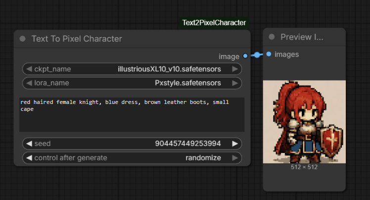

# ComfyUI_Text2PixelCharacter


This is my FIRST formal project !!!!!!


A custom ComfyUI node for generating cozy fantasy JRPG-style pixel characters from text prompts.

LIKE THIS:



This node automatically:

- Loads checkpoint and LoRA
- Generates a character from prompt
- Converts the result into pixel art
- Applies palette-based color matching
- Quantizes to 32 colors
- Upscales with nearest-neighbor scaling

Designed for consistent RPG sprite generation workflows.

---

# Features

- One-node workflow
- Hidden internal style prompts
- Built-in pixel art post-processing
- Automatic palette color matching
- 32-color quantization
- Built-in nearest-neighbor upscale
- Uses local checkpoints and LoRAs from the node folder
- Minimal user setup

---

# Installation

## 1. Clone into ComfyUI custom_nodes

```bash
cd ComfyUI/custom_nodes
git clone https://github.com/YOUR_USERNAME/ComfyUI_Text2PixelCharacter.git
```

---

## 2. Install requirements

```bash
cd ./ComfyUI_Text2PixelCharacter
pip install -r requirements.txt
```

---

## 3. Restart ComfyUI

After restarting, search for:

```txt
Text To Pixel Character
```

---

# Usage

Minimal workflow:

```txt
Text To Pixel Character
↓
Save Image
```

---

# Node Parameters

| Parameter | Description |
|---|---|
| ckpt_name | Checkpoint model |
| lora_name | LoRA model |
| character_prompt | Character description |
| seed | Generation seed |

---

# Example Prompt

```txt
red haired female knight, blue dress, brown leather boots, small cape
```

---

# Internal Processing Pipeline

The node internally performs:

```txt
Text Prompt
↓
SDXL Generation
↓
256x256 Latent Sampling
↓
VAE Decode
↓
Resize to 64x64
↓
Color Match
↓
32 Color Quantization
↓
Nearest Neighbor Upscale to 512x512
```

---

# Palette

The node uses:

```txt
palette.png
```

located in the project root as the color reference image.

You can replace it with your own palette reference image to change the overall visual style.

---

# Requirements

```txt
numpy
Pillow
torch
```

---

# Recommended Models

Works best with:

- SDXL checkpoints
- Pixel-art LoRAs
- Chibi fantasy character datasets

---

# Notes

- This project is intended for stylized RPG sprite generation.
- Final output style depends heavily on checkpoint and LoRA selection.
- Different checkpoints may produce different proportions and rendering styles.

---

# License

MIT License